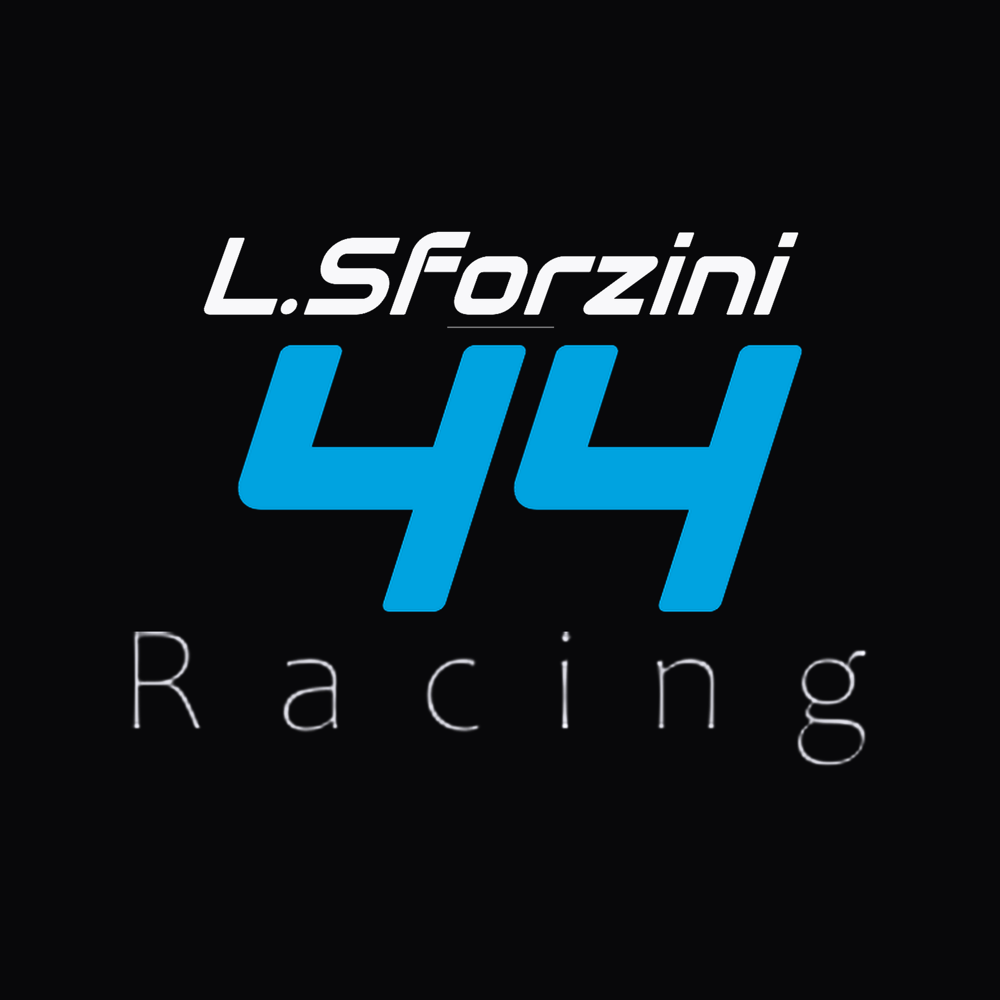
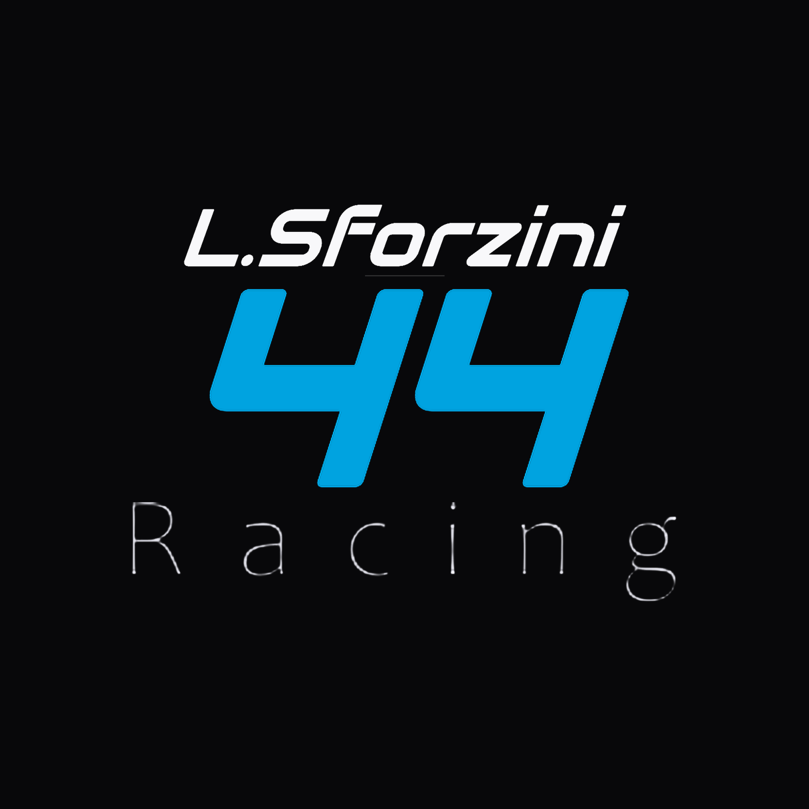
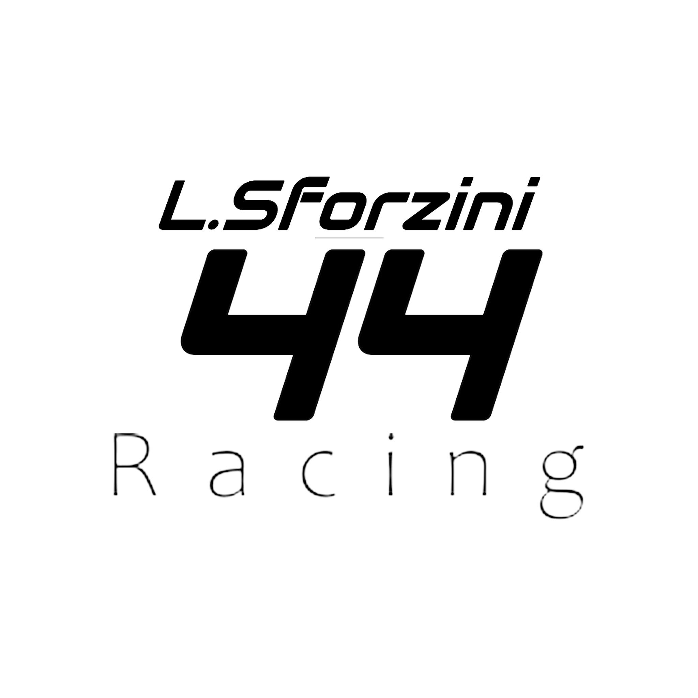
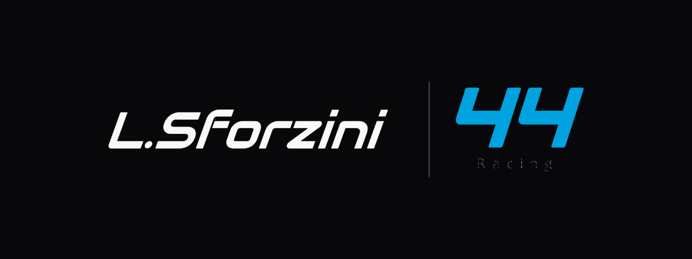
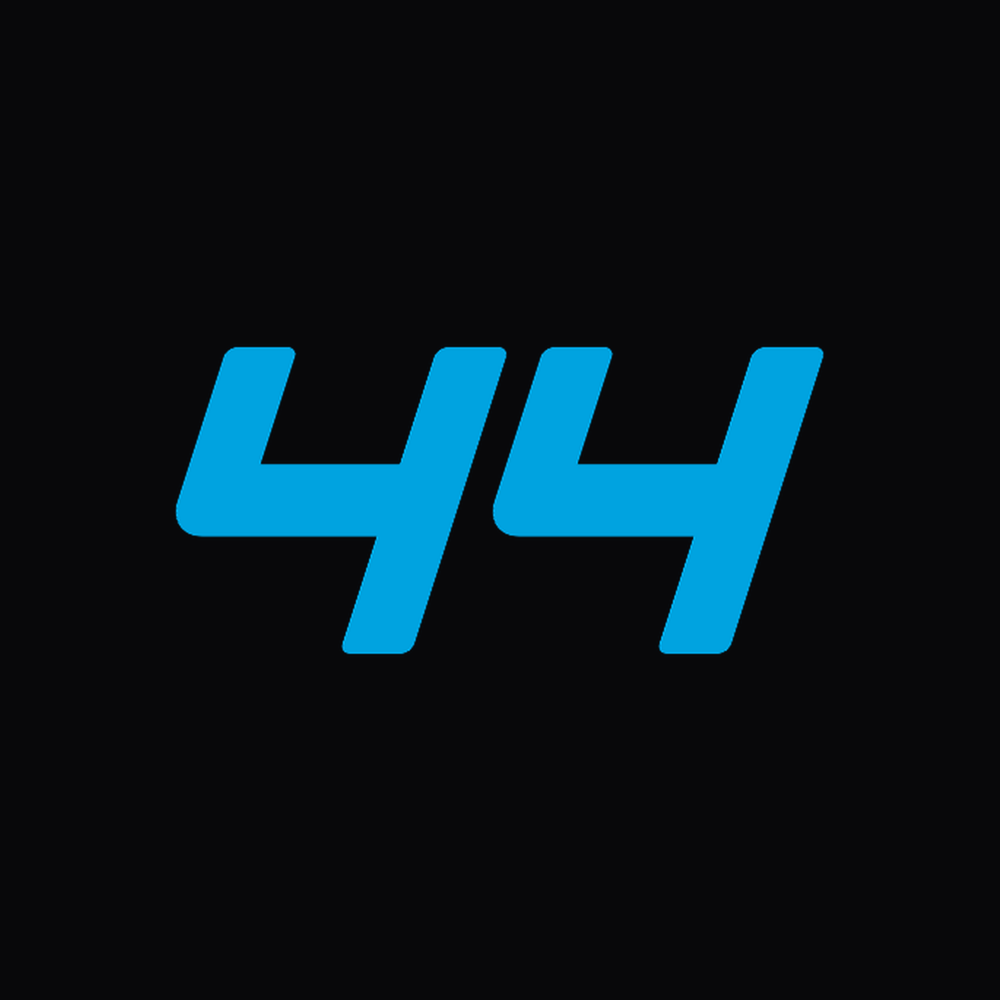
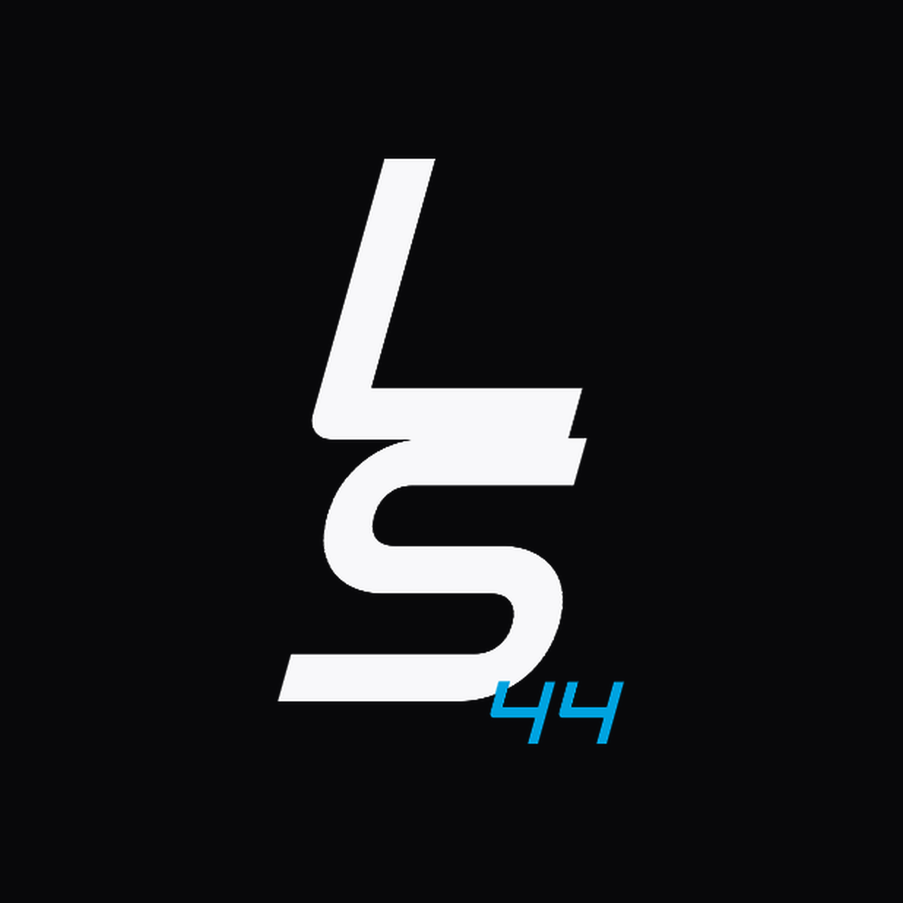
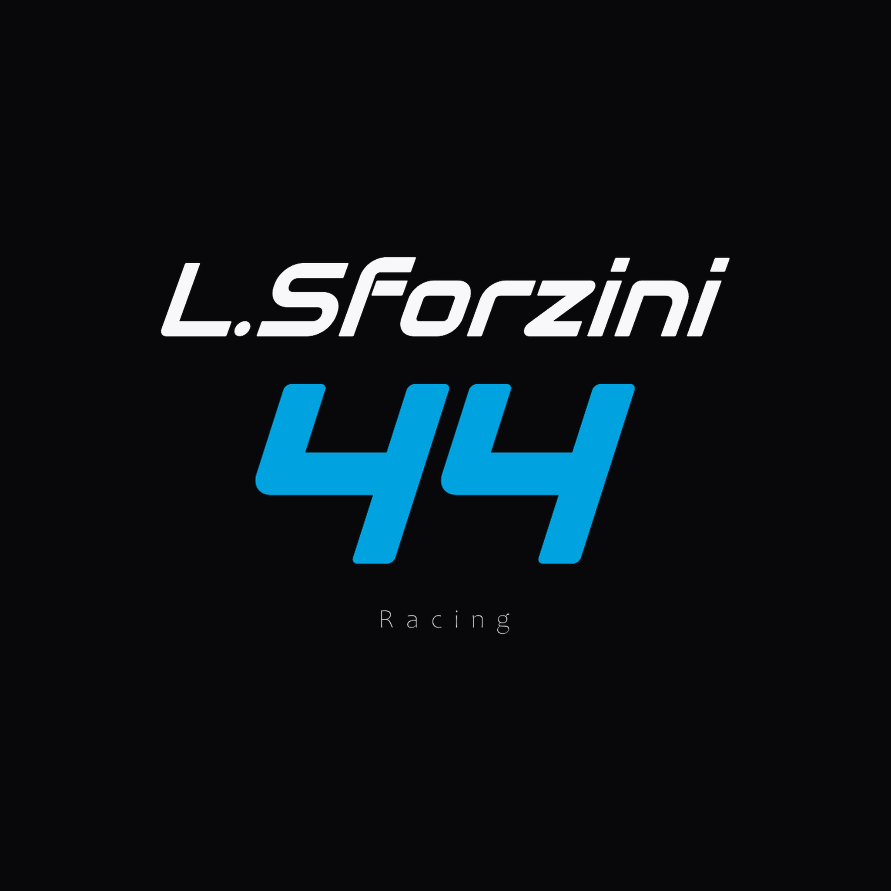
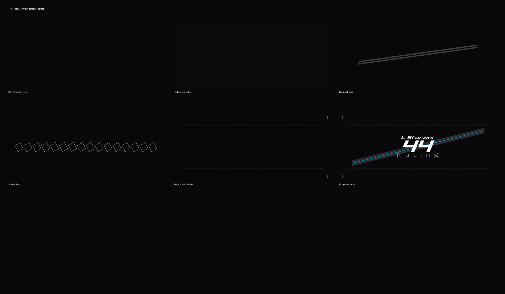

# Lorenzo Sforzini — L.Sforzini 44 Racing

Personal motorsport brand identity — carbon, ice, speed typography, and a modular abstract system for graphics, wallpapers, and stream.

<p align="center">
  
</p>

<p align="center">
  <strong>L.Sforzini</strong> · <strong>44</strong> · <em>Racing</em><br/>
  <sub>Ice on carbon · stripe −18° · electric blue accent</sub>
</p>

---

## Brand at a glance

| | |
|---|---|
| **Driver** | Lorenzo Sforzini |
| **Primary lockup** | Stacked wordmark + italic **44** + tracked *Racing* |
| **Surfaces** | Carbon `#08080A` · Carbon Mid `#121216` |
| **Type / marks** | Ice `#F8F8FA` · Ice Dim `#C8C8D0` · Silver `#A8A8B0` |
| **Hero accent** | Electric Blue `#00A3E0` (preferred on the **44**) |
| **Abstract language** | Carbon weave · parallelogram stripes (−18°, vertical ends) · chevron · hairlines |
| **Type** | Audiowide (display, shear 0.36) · italic 44 · Candara Light (*Racing*) |

Full tokens: [`brand-identity/brand-tokens.json`](brand-identity/brand-tokens.json)  
Brand book: [`brand-identity/index.html`](brand-identity/index.html)

---

## Logo system

### Primary stacked

<p align="center">
  
  &nbsp;
  
</p>

### Horizontal · mark · monogram

<p align="center">
  
</p>

<p align="center">
  
  &nbsp;&nbsp;&nbsp;
  
</p>

---

## Racing colorways

Preferred accent treatment: **ice wordmark + electric blue 44**.

<p align="center">
  
</p>

| Accent | Hex | Use |
|--------|-----|-----|
| Electric Blue | `#00A3E0` | Hero / CTA / primary number |
| Rosso Corsa | `#E10600` | Alternate motorsport accent |
| Papaya | `#FF8700` | Endurance energy |
| Signal Yellow | `#F5C400` | High-vis / pit signal |
| Racing Green | `#004225` | Heritage GT |
| Titanium | `#8A8F98` | Metal / carbon trim |

Sheets live under [`brand-identity/13-racing-colors/`](brand-identity/13-racing-colors/).

---

## Abstract system · motors / carbon

Modular layers for backgrounds and layouts — never rotated rectangles: stripes are **parallelograms** at **−18°** with **vertical ends**.

<p align="center">
  
</p>

**Layer order:** carbon base → weave → stripes → hairlines → accent bar → logo

---

## Generate

```powershell
cd C:\Users\simot\Documents\Projects\lorenzo-sforzini-racing
python generate_brand_identity.py
python generate_racing_colors.py
python generate_abstract_system.py
python generate_iphone_wallpaper.py
python generate_slideshow.py
```

---

<sub>Lorenzo Sforzini · L.Sforzini 44 Racing — ice on carbon · electric blue</sub>
