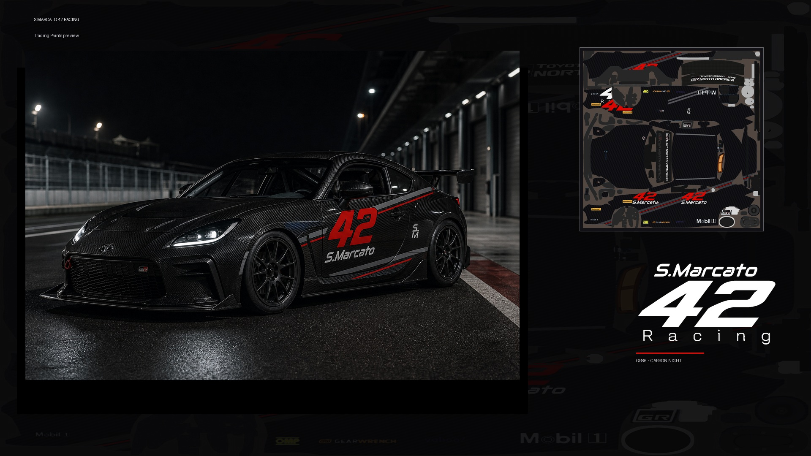

# GR86 · S.Marcato 42 Racing — Carbon Night

Trading Paints livrea for **Toyota GR86** template `160_template_GR86`.

## Design
- Base: carbon weave night
- Accents: ice / silver parallelogram stripes (−18°, vertical ends)
- Hero: **42** rosso corsa + S.Marcato wordmark
- Monogram on roof / nose

## Files
| File | Use |
|------|-----|
| `gr86_smarcato42_carbon_night.tga` | Main paint (2048×2048) — import into template / Trading Paints |
| `gr86_smarcato42_carbon_night.png` | Same paint as PNG |
| `gr86_smarcato42_carbon_night_spec.png` | Rough specular hint (optional) |
| `preview_hero.jpg` / `preview_hero.png` | Anteprima hero (auto ¾ + UV) |
| `preview_3q.png` | Mockup ¾ GR86 carbon night |
| `preview_compare.jpg` | Template vs livrea (UV flat) |

<p align="center">
  
</p>

## How to apply
1. Open `Toyota GR86.psd` in Photoshop (from Trading Paints template zip).
2. Turn off guide layers listed as *Turn Off Before Exporting TGA*.
3. Place `gr86_smarcato42_carbon_night.tga` above **Base Paint** (or replace Base Paint).
4. Keep **Car_Mandatory** / **Mask** / wire guides as required by the template.
5. Export TGA per Trading Paints instructions and upload.

Or upload the TGA directly in Trading Paints custom paint tools if the car supports flat texture upload.

## Regenerate
```powershell
cd C:\Users\simot\Documents\Projects\smarcato42-racing
python liveries/generate_gr86_carbon_night.py
```
